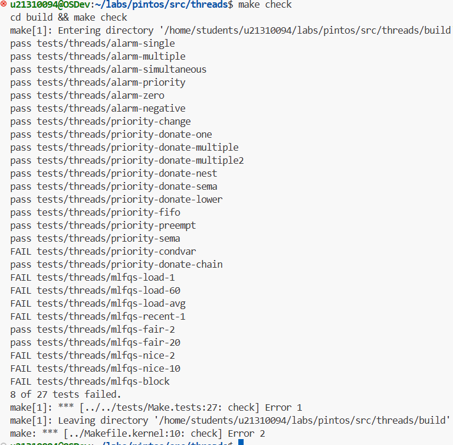

# Task 2
## 2.1 Priority Schduling
Target:
1.preemtive schedule
2.Avoid busy waiting

Modified(mainly):
1.The function is related with going to ready state.
```c
thread_create();
thread_unblock();
thread_yield();
```
Change the uneffective `push back` to `list_insert_ordered`.

And notice when a thread create,if the create priority is less than the new priority,then yield and rescheduled.Just like what `fork()` do in liunx.
## 2.2 Priority Donation
Target:
1.Normal recursive donation like nest donation
2.The priority queue design for lock,semaphore,condition variable.

Modified(mainly)
1.Heap Design
which fitts the lock ,semaphore and condition variable.

```c
typedef struct MaxHeap
{
	int size;
	int heap[10];
}MaxHeap;

...

void swim(MaxHeap *);
void swap(int*, int*);
void sink(int, MaxHeap*);
void heap_push(int, MaxHeap*);
//int extract();
void heap_remove(int, MaxHeap*);
int heap_top(MaxHeap*);
bool heap_empty(MaxHeap*);
void heap_init(MaxHeap*);
```

2.
`atomic modified` during acquiring lock,releasing lock 
and set priority
```c
void hold_the_lock(struct lock *);
void remove_the_lock(struct lock *);
//bool lock_cmp(const struct list_elem *,const struct list_elem *,void * aux); // Formatted
void donate(struct thread *);
void update(struct thread *);
```

## Data Structures
### Q2.1
1.
For the priority queue of donation of holding lock,
I design a max heap so that it can get the max donation in time complexity $O(log(n))$,which is better than my list desigin which cost $O(n)$.
```c
typedef struct MaxHeap
{
	int size;
	int heap[10];
}MaxHeap;

...

struct thread{
...
MaxHeap lock_heap;
...
};
```
2.
`waiting_locks` mean the lock list that the thread is waiting.And the `raw_priority` is made to deal with the
`priority-donate-lower` test,which ensure the highest priority that a thread can own.Both of them are made for recursively donation.
```c
struct thread{
    ...
    int raw_priority;
    struct lock * waiting_locks;
    ...
}
```

### Q2.2
1.The data structure to track donation
(Previous --- Based on List)
```c
struct thread{
...
struct list hloding_locks;
...
};

struct lock
{
    ...
     int max_priority;
    ...
};
```
(Improved --- Based on Heap)
```c
struct thread{
...
MaxHeap lock_heap;
...
};


struct lock
{
    ...
     int max_priority;
    ...
};
```
2.Nested Donation


## Algorithm

### Q2.3
For locks,I made a MaxHeap then it can get the highest from top easily.

(Can be Modified below --- Use Heap)
For semaphore,I made it to insert to list orderly and pick it from head which make same effect.

Condvar...
(Modified Here)


### Q2.4
Firstly,we can make up easily in use of the provided List API to deal with the recursively donation in 'lock_acquire()'.Just keep memory of locks each thread  hold or waiting.And then search holding lock recursilvely and donate one by one.

### Q 2.5
Make the donated thread doante back its priority to raw priority,then push it again to the heap.

## Synchronization
Maybe after the thread's priority modifying,the thread
get a switch to anther thread.Then `thread_yield()` is not going to happen immetialy which make a wrong schduled.

There are much like this.To prevent them,I drive interrupt by `intr_disable()` and roll back by `intr_set_level(prev_level)`,which is able to call as 
 `atomic modified`.It is necessary espiecially in such 
 basic level.

### Rationale

Because heap support insert and pop in time complexity $(log(n)),quite effectively and fit those sceniries.

Maybe Red-Black tree will be better,since it plays quite an vital role in modern OS design.


(代码运行结果)

